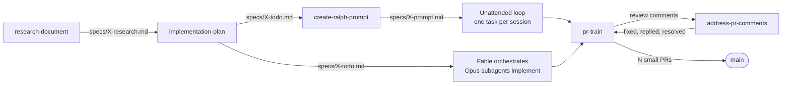

# dev-workflow-skills

Agent skills for the loop that actually ships features: **research → plan → autonomous execution → small reviewable PRs**. They work with Claude Code, Codex, and any other agent that reads `SKILL.md` folders, and they adapt themselves to your repo through a one-time onboarding step.

| Skill | What it does |
|---|---|
| [`research-document`](skills/research-document/SKILL.md) | Fans out subagents to document how a system *currently* works, then synthesizes one research doc with file:line references and a gap analysis. |
| [`implementation-plan`](skills/implementation-plan/SKILL.md) | Turns a research doc (or a fresh codebase scout) into a phased todo list of atomic tasks, each with concrete verification steps. |
| [`create-ralph-prompt`](skills/create-ralph-prompt/SKILL.md) | Writes a self-contained session prompt (plus a tracker for ad-hoc goals) for a one-task-per-session autonomous loop, and gives you the loop command. |
| [`pr-train`](skills/pr-train/SKILL.md) | Splits a finished feature into <500-LOC PRs, writes high-signal descriptions, and can drive the whole train through review and merge — sequentially, or as a native [GitHub stacked PR](https://docs.github.com/en/pull-requests/get-started/stacked-prs-quickstart) chain via `gh stack` — with guardrails. |
| [`address-pr-comments`](skills/address-pr-comments/SKILL.md) | Triages every unresolved review thread on a PR (CodeRabbit, Copilot, humans) against the code, specs, knowledge base, and conventions; fixes what's valid, dismisses noise with a cited reason, asks when unsure, replies and resolves threads, runs the gates, propagates up a stack. Runs interactively or from CI. |
| [`workflow-onboarding`](skills/workflow-onboarding/SKILL.md) | Runs the onboarding step on demand: infers your repo's conventions, asks only what's left, writes `.agents/workflow-context.md`. |



Each skill also stands alone. Use `pr-train` on any branch, `research-document` before any refactor.

## Why these exist

I built these to automate the parts of my daily work that kept hurting when handing real features to coding agents:

- **Stale context.** An `AGENTS.md` written months ago quietly becomes wrong, and an agent that trusts it produces confidently broken work. Dex Horthy's talks on context engineering (the [12-factor agents](https://github.com/humanlayer/12-factor-agents) material and his "advanced context engineering for coding agents" talk) convinced me that fresh, task-scoped context beats a big evergreen doc. `research-document` exists for that: it writes documentation *for the current task* that reflects the product as it is right now, with file:line references, so planning starts from truth instead of memory.
- **Autonomous execution that needs babysitting.** Geoffrey Huntley's [Ralph loops](https://ghuntley.com/ralph/) — one task per fresh session, repeat — work well, but writing the session prompt and a plan with a proper progress tracker got tiring to do by hand every time. `implementation-plan` and `create-ralph-prompt` are that work, packaged.
- **Flooding the team's PR backlog.** A feature built end-to-end by an agent is a POC, not a PR. Splitting it into digestible, cold-reviewable chunks and pacing them so the team is never staring at fifteen open PRs is what `pr-train` does, including driving the sequence to merge one PR at a time.
- **PR descriptions that don't help.** On my team, an open PR carries an implicit claim: it was exercised on a complete local environment that mirrors production, not just unit-tested. The description has to say the purpose, where a reviewer should focus, and exactly how it was tested locally. That's what lets us trust generated code. Your team's bar may differ, which is what the onboarding step is for.
- **Review-bot back-and-forth.** Every PR on my team gets a CodeRabbit review, and the signal-to-noise ratio varies a lot. `address-pr-comments` is my most-used skill: it triages each thread and grounds its verdict in the project's specs, knowledge base, and conventions instead of blindly accepting change requests, then replies and resolves the threads it settled. Once the bot comes back with zero new comments I do one final inspection myself and request review from the team, who then see a PR with the obvious wrinkles already handled. It also runs unattended: a CI job on my repos triggers the agent with this skill whenever new review comments land.

**How I use them today.** I still start with `research-document` and `implementation-plan`, but I rarely run ralph loops any more. Instead I hand the finished plan to Claude Fable and let it orchestrate: Fable works through the plan with Opus subagents as implementors, deciding itself what can run in parallel and what has to be sequential. `create-ralph-prompt` stays in the collection for when a fully unattended loop is the right tool.

## Install (one command)

The [`skills`](https://github.com/vercel-labs/skills) CLI installs into 70+ agents. Pick a scope:

```bash
# Project scope (this repo only) — installs for every agent it detects
npx skills add agent-pasha/dev-workflow-skills --all

# User scope (every project on this machine)
npx skills add agent-pasha/dev-workflow-skills --all -g

# Specific agents only
npx skills add agent-pasha/dev-workflow-skills --all -a claude-code -a codex

# One skill
npx skills add agent-pasha/dev-workflow-skills --skill pr-train

# Non-interactive (CI, dotfiles scripts)
npx skills add agent-pasha/dev-workflow-skills --all -g -y
```

Later: `npx skills update` pulls new versions, `npx skills list` shows what's installed.

### Without Node

```bash
# Project scope, Claude Code + Codex (canonical copy in .agents/skills, symlinked into .claude/skills and .codex/skills)
curl -fsSL https://raw.githubusercontent.com/agent-pasha/dev-workflow-skills/main/install.sh | bash

# User scope
curl -fsSL https://raw.githubusercontent.com/agent-pasha/dev-workflow-skills/main/install.sh | bash -s -- --scope user

# Only some skills, only Claude Code, copies instead of symlinks
curl -fsSL https://raw.githubusercontent.com/agent-pasha/dev-workflow-skills/main/install.sh | bash -s -- --skills pr-train,implementation-plan --agent claude --copy

# Any other agent: point at its skills directory
curl -fsSL https://raw.githubusercontent.com/agent-pasha/dev-workflow-skills/main/install.sh | bash -s -- --dest ~/.config/some-agent/skills
```

`install.sh --help` lists every option. Where a skill directory lands for each agent:

| Agent | Project scope | User scope |
|---|---|---|
| Claude Code | `.claude/skills/<skill>/` | `~/.claude/skills/<skill>/` |
| Codex | `.codex/skills/<skill>/` | `~/.codex/skills/<skill>/` |
| Agent-neutral (`AGENTS.md` ecosystem, Cursor, OpenCode, …) | `.agents/skills/<skill>/` | `~/.agents/skills/<skill>/` |

## Onboarding: making the skills fit your repo

These skills were distilled from one team's workflow, and most of their value comes from being tailored: real test commands, real branch protection, real risk tiers. Rather than ship those baked in, every skill reads them from one file at your repo root:

```
.agents/workflow-context.md
```

**The first time any skill runs in a repo without that file, it onboards itself:**

1. **Infers** as much as it can from the repository — workspace manifests, CI workflows, `Makefile`/`package.json` scripts, `git log` ticket prefixes, branch names, PR templates, labels, branch protection, `docker-compose`/`Tiltfile`, `CODEOWNERS`, existing docs.
2. **Asks you only what it couldn't infer**, in one batch, each question showing what it found and offering a default. Typical survivors: which paths are mission-critical, whether auto-merge is ever OK, how to verify a change on a live environment, whether AI-attribution trailers are wanted.
3. **Writes the file** and asks you to commit it, so every teammate and every agent shares the same conventions.

To do it up front instead of on first use, run the onboarding right after installing:

```
/workflow-onboarding          # Claude Code
"run workflow onboarding"     # any agent
```

Re-run it whenever conventions change ("refresh workflow context"). The file is plain markdown — edit it by hand any time. The full procedure and the file template live in [`shared/onboarding.md`](shared/onboarding.md).

What the file captures:

| Section | Used by |
|---|---|
| Repository — monorepo areas and paths | research-document, implementation-plan |
| Specs & Docs — where research/plans/prompts go, where decisions and the knowledge base live | all |
| Tickets, Branches, Commits — key format, naming, trailers | pr-train, create-ralph-prompt, address-pr-comments |
| Gates — build/test/lint/typecheck per area | pr-train, implementation-plan, create-ralph-prompt, address-pr-comments |
| Local Environment — start command, how to verify each change type | implementation-plan, create-ralph-prompt, pr-train |
| Pull Requests — merge method, protection, labels, bots, risk tiers | pr-train, address-pr-comments |
| Autonomous Sessions — agent CLI, loop command, subagent budget, reference implementations, the agent's GitHub login | research-document, implementation-plan, create-ralph-prompt, address-pr-comments |

## Philosophy

- **Research before planning, plan before executing.** Every plan task points at real files and ends with a verification step. "It should work" is not verification.
- **One task per session.** Autonomous loops restart with a fresh context for each task, so progress is incremental and reversible.
- **Small PRs, paced.** Under 500 lines of meaningful diff, reviewable cold, one open at a time. A feature that needs 30 PRs gets 30 PRs — over time, not all at once.
- **Guardrails over trust.** The agent never approves its own PR, never admin-merges, never force-pushes anything but the chunk's own branch, and stops to ask on anything destructive or ambiguous.
- **Conventions live in the repo, not in the skill.** The onboarding file is the contract between the skills and your team.

## Requirements

- An agent that supports `SKILL.md` skills (Claude Code, Codex, Cursor, OpenCode, …).
- `git`, and for `pr-train`: the [GitHub CLI](https://cli.github.com/) (`gh`).
- For stacked PR chains, `pr-train` drives GitHub's native [stacked pull requests](https://docs.github.com/en/pull-requests/get-started/stacked-prs-quickstart) through the `gh stack` extension. Install it with `gh extension install github/gh-stack`, and consider adding a dedicated gh-stack skill so your agent knows the extension's non-interactive flags and conflict recovery; `pr-train` defers to it when present.
- Subagent support in your agent makes `research-document` and `implementation-plan` much faster, but both fall back to sequential investigation.

## Contributing

- `shared/onboarding.md` is the single source for the onboarding procedure. After editing it, run `scripts/sync-shared.sh` to copy it into each skill's `references/`; CI fails if the copies drift.
- Keep skills repo-agnostic. Anything team-specific belongs in `.agents/workflow-context.md`, which the skills read at runtime.
- Test a change by installing from your checkout: `./install.sh --source . --dest /tmp/skills-test`.

## License

MIT — see [LICENSE](LICENSE).
